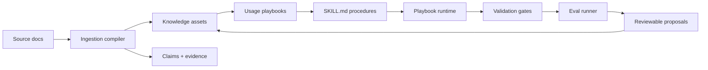

<p align="center">
  <a href="./README.zh.md">简体中文</a>
  ·
  <a href="https://2sao7sao.github.io/EvolveKB/">Product Page</a>
  ·
  <a href="./examples/evolution_loop.md">Flagship Demo</a>
  ·
  <a href="./CONTRIBUTING.md">Contributing</a>
</p>

<p align="center">
  
  
  
  
</p>

# Stop Treating Knowledge As Chunks

**EvolveKB turns documents into executable, verifiable, and reviewable agent knowledge.**

RAG can retrieve similar fragments. EvolveKB asks a different question:

> Can this knowledge become a behavior an agent can reliably execute, test, and improve?

If your agent depends on policies, runbooks, research notes, internal playbooks,
or engineering rules, raw chunks are not enough. The agent needs to know what
the knowledge means, when to use it, how to execute it, how to verify it, and
how to update it safely after practice exposes a gap.


## The 30-Second Pitch

```text
Docs -> Claims -> Knowledge Assets -> Usage Playbooks -> SKILL.md -> Gates -> Evals -> Proposals
```

EvolveKB is an **execution-first knowledge runtime**:

| Instead of... | EvolveKB makes knowledge... |
| --- | --- |
| Similarity chunks | Typed, sourced, and inspectable |
| Prompt stuffing | Bound to usage playbooks |
| One-off answers | Executable through `SKILL.md` procedures |
| Silent drift | Protected by gates and regression evals |
| Black-box updates | Proposed, reviewed, and rollbackable |

## Run The Demo

```bash
git clone https://github.com/2sao7sao/EvolveKB.git
cd EvolveKB
python -m pip install -e ".[dev]"
python examples/run_evolution_loop.py
```

The demo copies the repo to a temporary workspace, ingests a synthetic refund
policy, generates a reviewable proposal, runs validation gates, runs evals, and
lists the pending knowledge update without touching your working tree.

## Why It Exists

Most knowledge systems optimize retrieval. Agent systems need operational
knowledge.

| Real agent problem | Why chunk retrieval is weak | EvolveKB direction |
| --- | --- | --- |
| A policy must drive a support workflow | The model sees text but not the procedure | Bind policy to usage assets and skills |
| A runbook changes after an incident | Retrieval does not manage safe updates | Generate proposals and run gates |
| A design rule has exceptions | Similarity hides cross-document dependencies | Store claims, concepts, evidence, and usage rules |
| A knowledge update can break old behavior | Vector stores do not regression-test use | Run evals before accepting changes |

## What You Get

| Layer | Role |
| --- | --- |
| `kb/knowledge` | Typed knowledge assets with summaries, concepts, claims, evidence, and source refs. |
| `kb/usage` | Intent-level instructions for how knowledge should be applied. |
| `skills/` | Executable `SKILL.md` procedures that turn knowledge into repeatable behavior. |
| `evolvekb/gates` | Validation for schemas, references, skill contracts, and production constraints. |
| `evolvekb/evals` | Regression cases for retrieval and routing behavior. |
| `kb/proposals` | Auditable knowledge changes before they are accepted. |

## Proof Signals

Last verified locally:

| Signal | Result | Command |
| --- | ---: | --- |
| Unit + integration tests | `57 / 57 passed` | `python -m pytest -q` |
| Repository gates | `PASS` | `python -m evolvekb.cli validate --settings settings/evolve.yaml` |
| Retrieval eval | `1 / 1 passed` | `python -m evolvekb.cli eval run "evals/*.yaml"` |
| Routing eval | `1 / 1 passed` | `python -m evolvekb.cli eval run "evals/*.yaml"` |

These are regression seeds, not broad benchmark claims. They prove the runtime
loop is executable; larger knowledge-evolution benchmarks should be added before
claiming superiority over RAG systems.

## Quick Commands

```bash
# Validate the repository
python -m evolvekb.cli validate --settings settings/evolve.yaml

# Query evidence
python -m evolvekb.cli query "execution-first knowledge runtime" --require-evidence

# Run a knowledge-backed playbook
python -m evolvekb.cli run \
  --intent compare_frameworks \
  --question "Compare GraphRAG vs Execution-first" \
  --settings settings/reference.yaml \
  --no-side-effects

# Create an evolvable proposal from a document
python -m evolvekb.cli ingest examples/refund_policy.md --proposal
```

## When To Use It

Good fit:

| Use case | Why |
| --- | --- |
| Internal policies and SOPs | Knowledge must trigger governed behavior. |
| Agent skills and playbooks | Procedures need evidence and regression tests. |
| Research or design systems | Knowledge has hidden dependencies and usage rules. |
| Incident runbooks | Practice should safely update the knowledge base. |

Poor fit:

| Use case | Better choice |
| --- | --- |
| Disposable document Q&A | A simple RAG pipeline is enough. |
| Pure semantic search | Use a vector store or hybrid retriever. |
| Fully autonomous memory writes | Use a memory system with user controls and privacy policy. |

## Architecture



## Repository Map

```text
evolvekb/       # runtime, CLI, gates, ingestion, retrieval, evals
kb/             # knowledge assets, usage assets, index, evolution log
skills/         # executable SKILL.md playbooks and procedures
settings/       # reference, digest, transform, evolve presets
evals/          # retrieval and routing regression cases
examples/       # demo inputs, outputs, and runnable replay
docs/           # product page and supporting docs
```

## Roadmap

| Area | Next step |
| --- | --- |
| Evaluation | Add RAG baseline comparisons and knowledge-use success metrics. |
| Skills | Strengthen `SKILL.md` contracts and failure-mode tests. |
| Governance | Improve proposal review, rollback metadata, and change attribution. |
| Agent integration | Add single-agent and multi-agent harness examples. |

## Security

Do not commit private documents, API keys, tokens, customer traces, or raw
proposal outputs containing sensitive data. See [SECURITY.md](SECURITY.md).

## License

MIT. See [LICENSE](LICENSE).
