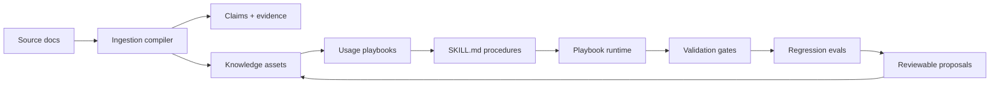

<p align="center">
  <a href="./README.zh.md">简体中文</a>
  ·
  <a href="https://2sao7sao.github.io/EvolveKB/">Product Page</a>
  ·
  <a href="./examples/evolution_loop.md">Flagship Demo</a>
  ·
  <a href="./CONTRIBUTING.md">Contributing</a>
</p>

<p align="center">
  
  
  
  
</p>

# EvolveKB

**Agent knowledge runtime: turn documents into executable, verifiable, and evolvable agent knowledge.**

RAG finds similar text. EvolveKB asks a stricter product question:

> Can this document become a behavior an agent can execute, test, review, and safely improve after real use?

If your agent depends on policies, runbooks, support procedures, research notes,
or engineering rules, the system needs more than retrieved chunks. It needs
claims, evidence, usage playbooks, skill contracts, validation gates, regression
evals, and reviewable knowledge updates.


## 30-Second Product Path

```text
Document
  -> grounded claims
  -> typed knowledge asset
  -> usage playbook
  -> SKILL.md procedure
  -> validation gates
  -> regression evals
  -> reviewable proposal
```

| If you have... | EvolveKB gives the agent... |
| --- | --- |
| Policy documents | Evidence-backed rules and exceptions |
| SOPs and runbooks | Repeatable playbooks instead of prompt stuffing |
| Internal methodology | Usage guidance for when and how to apply knowledge |
| Knowledge drift | Gates, evals, proposals, and rollback paths |
| Agent harnesses | A runtime surface for skills, evidence, and governance |

## 5-Minute Demo

```bash
git clone https://github.com/2sao7sao/EvolveKB.git
cd EvolveKB
python -m pip install -e ".[dev]"
python -m evolvekb.cli demo
```

The demo runs in an isolated temporary workspace. It ingests a synthetic refund
policy, extracts grounded claims, creates a pending proposal, runs gates and
regression evals, and prints product metrics without modifying your working
tree.

Expected shape:

```text
# EvolveKB Flagship Demo

status: PASS

## 1. Ingest policy into knowledge assets
- claims: 5
- grounded_claims: 5
- proposal: kb/proposals/...

## 3. Product metrics
- claim_grounding_rate: 1.00 (5/5)
- playbook_success_rate: 1.00 (2/2)
- proposal_gate_pass_rate: 1.00 (1/1)
- retrieval_vs_playbook_delta: 0.80 (4/5)
```

`examples/run_evolution_loop.py` runs the same product path for users who prefer
an executable example script.

## Why This Is Not Just RAG

| Question | Retrieval-only KB | EvolveKB |
| --- | --- | --- |
| Can the agent find relevant text? | Yes | Yes |
| Does the knowledge have typed claims and evidence? | Usually no | Yes |
| Does the system know how the knowledge should be used? | Usually no | Usage playbooks |
| Can a workflow run as a repeatable skill? | No | `SKILL.md` procedures |
| Can updates be gated and reviewed? | Rarely | Proposals + validation |
| Can behavior regressions be tested? | Rarely | Eval seeds and runtime checks |

> [!NOTE]
> The current retrieval backend is deterministic keyword retrieval. EvolveKB is
> not claiming semantic-search superiority. The point of this v0.3 path is to
> make knowledge operational: usable, testable, reviewable, and safe to evolve.

## Metrics That Map To Code

The demo metrics are computed from runtime artifacts, not manually edited
README numbers.

| Metric | What it measures | Current demo source |
| --- | --- | --- |
| `claim_grounding_rate` | Extracted claims that retain source evidence | `evolvekb.ingestion.compiler` |
| `playbook_success_rate` | Seed routing/retrieval evals passed by the runtime | `evolvekb.evals.runner` |
| `proposal_gate_pass_rate` | Proposal created while repository gates stay green | `evolvekb.demo` + `evolvekb.gates` |
| `retrieval_vs_playbook_delta` | Capability coverage gained over retrieval-only baseline | `evolvekb.demo` |

Run the regression seed directly:

```bash
python -m evolvekb.cli eval run "evals/*.yaml"
```

## Developer Surface

```bash
# Validate knowledge, usage assets, skills, and gate constraints
python -m evolvekb.cli validate --settings settings/evolve.yaml

# Query evidence from knowledge assets and compiled claims
python -m evolvekb.cli query "execution-first knowledge runtime" --require-evidence

# Run a knowledge-backed playbook
python -m evolvekb.cli run \
  --intent compare_frameworks \
  --question "Compare GraphRAG vs Execution-first" \
  --settings settings/reference.yaml \
  --no-side-effects

# Compile a document into a reviewable proposal
python -m evolvekb.cli ingest examples/refund_policy.md --proposal
```

Minimal harness integration:

```python
from pathlib import Path

from evolvekb.skills.runtime import PlaybookRuntime

runtime = PlaybookRuntime(Path("."))
result = runtime.run(
    intent="answer_with_evidence",
    question="What does the KB say about execution-first knowledge?",
    settings_arg="settings/reference.yaml",
    write_side_effects=False,
)
print(result.rendered)
```

## Architecture



## What Is Stable vs Prototype

| Layer | Current status |
| --- | --- |
| Asset schemas | Stable enough for local experiments and examples |
| CLI demo, validate, query, run, ingest, eval | Supported product path |
| Proposal creation and rollback | Supported for local files |
| Keyword retrieval | Prototype baseline, not the final retrieval strategy |
| Procedure implementations | Deterministic MVP examples, not a full skill marketplace |
| Benchmark claims | Seed-level proof only, not a broad RAG replacement benchmark |

## Fit / Non-Fit

Good fit:

| Scenario | Why |
| --- | --- |
| Agent policies and SOPs | Knowledge must trigger governed behavior |
| Support, compliance, or ops playbooks | Answers need evidence, routing, and approvals |
| Research-to-practice knowledge | Hidden usage rules matter more than similar chunks |
| Runbooks that evolve after incidents | Practice should update knowledge through review |

Poor fit:

| Scenario | Better choice |
| --- | --- |
| Disposable document Q&A | A simple RAG pipeline is faster |
| Pure semantic search | Use vector or hybrid retrieval |
| User memory and personalization | Use a memory system with privacy controls |
| Unreviewed autonomous writes | Add human review and approval gates first |

## Repository Map

```text
evolvekb/       runtime, CLI, demo metrics, gates, ingestion, retrieval, evals
kb/             knowledge assets, usage assets, index, evolution log
skills/         executable SKILL.md playbooks and procedures
settings/       reference, digest, transform, evolve presets
evals/          retrieval, routing, and capability coverage seeds
examples/       runnable demo inputs and product walkthrough
docs/           product page and supporting explanations
```

## Roadmap

| Area | Next step |
| --- | --- |
| Retrieval | Add pluggable semantic/hybrid retrievers behind the same evidence contract |
| Evaluation | Add RAG baseline tasks and larger knowledge-use benchmarks |
| Skills | Strengthen skill contracts, failure modes, and harness examples |
| Governance | Improve proposal review metadata, approvals, and rollback reports |
| Agent integration | Add single-agent and multi-agent harness recipes |

## Security

Do not commit private documents, API keys, tokens, customer traces, or proposal
outputs containing sensitive data. See [SECURITY.md](SECURITY.md).

## License

MIT. See [LICENSE](LICENSE).
