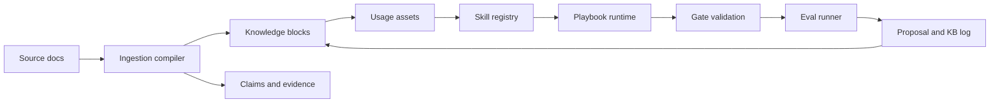

<p align="center">
  <a href="./README.md"></a>
  <a href="./README.zh.md"></a>
  <a href="./LICENSE"></a>
  
  
</p>

# EvolveKB

**EvolveKB is an execution-first knowledge runtime for AI agents.**

It turns static documents into typed knowledge assets, binds them to reusable
skills, validates every update with gates, and keeps an auditable evolution
trail. The goal is not to build another vector store. The goal is to make
knowledge operational: retrievable, executable, reviewable, and safe to evolve.

```text
Docs -> Knowledge Assets -> Usage Playbooks -> Skills -> Gates -> Evals -> Proposals
```

## Why EvolveKB

Most RAG pipelines answer the question "can we retrieve the right fragments?"
EvolveKB asks a more agent-native question:

> Can this knowledge become a reusable behavior that an agent can reliably execute?

That difference matters when knowledge is not just background context but part
of a production workflow. A policy, research note, design principle, customer
playbook, or internal engineering rule should not remain an unstructured chunk.
It should have ownership, schema, usage rules, validation gates, and regression
checks.

## The Evolution Loop

EvolveKB is designed around a practice-driven loop:

```text
Read -> Distill -> Bind to usage -> Execute as skill -> Verify -> Propose update
```

The important product distinction is the last step. When an agent fails because
the knowledge is incomplete, stale, or hard to apply, EvolveKB should not just
retrieve more text. It should produce a reviewable proposal that updates the
knowledge asset, usage playbook, or skill contract and then protects the change
with gates and regression evals.

## What It Provides

| Layer | What it does | Why it matters |
| --- | --- | --- |
| Knowledge assets | Stores distilled concepts, summaries, evidence, and source references under a schema. | Keeps knowledge compact, inspectable, and versionable. |
| Usage assets | Describes how knowledge should be applied for an intent. | Separates "what we know" from "how we use it". |
| Skills | Encodes executable playbooks and procedures in `SKILL.md`. | Turns knowledge into repeatable agent behavior. |
| Gates | Validates asset shape, references, skill contracts, and stricter production constraints. | Prevents silent drift and broken knowledge links. |
| Eval runner | Runs retrieval and routing regression cases. | Makes knowledge changes measurable before they are accepted. |
| Proposals | Writes reviewable change proposals before applying updates. | Keeps evolution auditable instead of automatic and opaque. |
| CLI | Exposes validation, run, query, ingest, proposal, and eval commands. | Makes the system usable in CI and local agent workflows. |

## Architecture




## Capability Snapshot

Last verified locally on **2026-05-07**.

| Signal | Current result | Command |
| --- | ---: | --- |
| Unit and integration tests | `57 / 57 passed` | `python -m pytest -q` |
| Repository validation gates | `PASS` | `python -m evolvekb.cli validate --settings settings/evolve.yaml` |
| Retrieval eval cases | `1 / 1 passed` | `python -m evolvekb.cli eval run "evals/*.yaml"` |
| Routing eval cases | `1 / 1 passed` | `python -m evolvekb.cli eval run "evals/*.yaml"` |

The current eval set is intentionally small and should be treated as a
regression seed, not a broad benchmark. It verifies two important paths:
retrieving the `execution-first-kb` knowledge asset for an execution-first
query, and routing the `answer_with_evidence` intent to the
`answer-with-evidence` playbook.

Test coverage currently exercises config loading, frontmatter parsing, typed
models, asset registry checks, duplicate detection, reference resolution, skill
routing, playbook execution, ingestion, proposal apply/rollback, KB linting,
evidence query, CLI wrappers, and eval execution.

## Quick Start

```bash
git clone https://github.com/2sao7sao/EvolveKB.git
cd EvolveKB
python -m pip install -e ".[dev]"
```

Validate the repository:

```bash
python -m evolvekb.cli validate --settings settings/evolve.yaml
python -m pytest -q
python -m evolvekb.cli eval run "evals/*.yaml"
```

Run a knowledge-backed playbook:

```bash
python -m evolvekb.cli run \
  --intent compare_frameworks \
  --question "Compare GraphRAG vs Execution-first" \
  --settings settings/reference.yaml \
  --no-side-effects
```

Query evidence:

```bash
python -m evolvekb.cli query "execution-first knowledge runtime" --require-evidence
```

Inspect skills:

```bash
python -m evolvekb.cli skills list
python -m evolvekb.cli skills inspect answer-with-evidence
```

Read the flagship product demo:

- [From static policy to verified agent skill](examples/evolution_loop.md)

## Repository Layout

```text
evolvekb/       # package runtime, CLI, gates, ingestion, retrieval, evals
kb/             # knowledge assets, usage assets, index, and evolution log
skills/         # executable SKILL.md playbooks and procedures
settings/       # reference, digest, transform, and evolve mode presets
evals/          # retrieval and routing regression cases
examples/       # rendered demo outputs
scripts/        # compatibility wrappers around the package runtime
```

Schema references:

- [kb/SCHEMA.md](kb/SCHEMA.md): knowledge and usage asset schema.
- [settings/SCHEMA.md](settings/SCHEMA.md): mode and gate configuration schema.

## Operating Modes

| Mode | Use it when | Behavior |
| --- | --- | --- |
| `reference` | You need grounded answers with minimal transformation. | Keeps output close to retrieved evidence. |
| `digest` | You need compact synthesis. | Summarizes and compresses the relevant knowledge. |
| `transform` | You need knowledge converted into another format or structure. | Applies usage rules and procedure steps. |
| `evolve` | You want a reviewable knowledge update. | Creates proposals and runs validation before acceptance. |


## Example Workflow

1. Add or ingest a source document.
2. Compile it into a typed knowledge asset with claims and evidence.
3. Link the asset to a usage playbook.
4. Run the playbook through the skill runtime.
5. Validate references, contracts, size limits, and gate policy.
6. Run retrieval/routing evals.
7. Apply or roll back the proposal after review.

```bash
python -m evolvekb.cli ingest docs/example.md --proposal
python -m evolvekb.cli proposal list
python -m evolvekb.cli validate --settings settings/evolve.yaml
python -m evolvekb.cli eval run "evals/*.yaml"
```

## When To Use It

| Good fit | Poor fit |
| --- | --- |
| Agent systems that need governed knowledge updates. | Pure semantic search with no workflow layer. |
| Internal playbooks, policies, research notes, and engineering rules. | One-off Q&A over disposable documents. |
| Teams that want knowledge changes reviewed like code. | Systems that require fully autonomous memory writes without review. |
| Skill-based agents where knowledge should trigger repeatable behavior. | Use cases where raw retrieved chunks are enough. |

## Current Boundaries

EvolveKB is a working prototype, not yet a complete enterprise knowledge
platform. The current repository does not yet include large-scale retrieval
benchmarks, model-graded answer quality, multi-agent orchestration tests,
permission-aware document access, or production observability. The existing
tests are valuable because they protect the engineering loop, but broader
benchmarks should be added before claiming model or production superiority.

## Roadmap

| Area | Next direction |
| --- | --- |
| Evaluation | Expand retrieval, routing, evidence coverage, and playbook success cases. |
| Skills | Add stronger skill contracts, examples, and failure-mode tests. |
| Governance | Improve proposal review, rollback metadata, and change attribution. |
| Retrieval | Add hybrid retrieval and larger evidence packs. |
| Agent integration | Expose a cleaner harness for single-agent and multi-agent workflows. |

## License

MIT. See [LICENSE](LICENSE).
