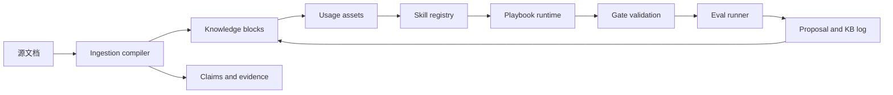
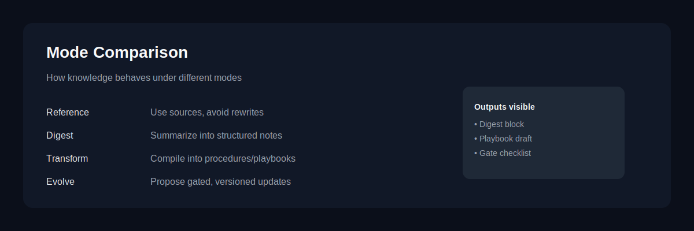

<p align="center">
  <a href="./README.md"></a>
  <a href="./README.zh.md"></a>
  <a href="https://2sao7sao.github.io/EvolveKB/"></a>
  <a href="./CONTRIBUTING.md"></a>
  <a href="./LICENSE"></a>
  
  
</p>

# EvolveKB

**EvolveKB 是一个面向 AI Agent 的 execution-first 知识运行时。**

它把静态文档转化为带类型的知识资产，再绑定到可复用 skills，通过 gates
验证每次更新，并保留可审计的演化记录。它不是另一个向量库，而是让知识进入
工程链路：可检索、可执行、可校验、可回滚、可持续演化。

```text
Docs -> Knowledge Assets -> Usage Playbooks -> Skills -> Gates -> Evals -> Proposals
```

## 为什么需要 EvolveKB

多数 RAG 系统解决的是“能不能找回相关片段”。EvolveKB 关注的是更接近
Agent 落地的问题：

> 这份知识能不能变成一个 Agent 可以稳定执行的可复用行为？

当知识不只是背景资料，而是生产流程的一部分时，这个差异会非常关键。政策、
研究笔记、设计原则、客户处理 SOP、工程规范，都不应该只是散落的 chunk。
它们需要所有权、schema、使用规则、验证门禁和回归测试。

## 知识演进闭环

EvolveKB 围绕一条实践驱动的闭环设计：

```text
阅读 -> 提炼 -> 绑定用法 -> 作为 skill 执行 -> 验证 -> 提出更新
```

真正的差异在最后一步。当 Agent 失败是因为知识不完整、过期、或者难以应用时，
EvolveKB 不应该只是继续检索更多文本，而是生成可评审的 proposal，更新知识资产、
usage playbook 或 skill contract，并通过 gates 与回归 eval 保护这次变化。

## 核心能力

| 层级 | 做什么 | 价值 |
| --- | --- | --- |
| Knowledge assets | 用 schema 管理概念、摘要、证据和来源引用。 | 让知识更紧凑、可检查、可版本化。 |
| Usage assets | 描述某类 intent 应该如何使用知识。 | 把“知道什么”和“怎么使用”分离。 |
| Skills | 用 `SKILL.md` 编码可执行 playbook 和 procedure。 | 把知识转化为可复用的 Agent 行为。 |
| Gates | 校验资产结构、引用、skill contract 和生产约束。 | 避免知识链接断裂、格式漂移和隐性失败。 |
| Eval runner | 运行 retrieval 和 routing 回归样例。 | 在接受知识变更前得到可复现信号。 |
| Proposals | 在写入前生成可评审的变更提案。 | 让知识演化可审计，而不是黑盒自动更新。 |
| CLI | 暴露 validate、run、query、ingest、proposal、eval。 | 便于接入 CI、本地开发和 Agent harness。 |

## 架构




## 当前可复现指标

本地最后验证时间：**2026-05-07**。

| 信号 | 当前结果 | 命令 |
| --- | ---: | --- |
| 单测与集成测试 | `57 / 57 passed` | `python -m pytest -q` |
| 仓库验证 gates | `PASS` | `python -m evolvekb.cli validate --settings settings/evolve.yaml` |
| Retrieval eval | `1 / 1 passed` | `python -m evolvekb.cli eval run "evals/*.yaml"` |
| Routing eval | `1 / 1 passed` | `python -m evolvekb.cli eval run "evals/*.yaml"` |

当前 eval 集合规模很小，只应视为回归种子，而不是完整 benchmark。它验证了
两个关键链路：execution-first query 能检索到 `execution-first-kb` 知识资产；
`answer_with_evidence` intent 能路由到 `answer-with-evidence` playbook。

现有测试覆盖 config 加载、frontmatter 解析、typed models、资产注册表、
重复 ID 检测、引用解析、skill 路由、playbook 执行、文档摄取、proposal
apply/rollback、KB lint、证据查询、CLI wrapper 和 eval runner。

## 快速开始

```bash
git clone https://github.com/2sao7sao/EvolveKB.git
cd EvolveKB
python -m pip install -e ".[dev]"
```

验证仓库：

```bash
python -m evolvekb.cli validate --settings settings/evolve.yaml
python -m pytest -q
python -m evolvekb.cli eval run "evals/*.yaml"
```

运行一个知识驱动的 playbook：

```bash
python -m evolvekb.cli run \
  --intent compare_frameworks \
  --question "Compare GraphRAG vs Execution-first" \
  --settings settings/reference.yaml \
  --no-side-effects
```

查询证据：

```bash
python -m evolvekb.cli query "execution-first knowledge runtime" --require-evidence
```

查看 skills：

```bash
python -m evolvekb.cli skills list
python -m evolvekb.cli skills inspect answer-with-evidence
```

查看产品主 demo：

- [从静态政策到可验证 Agent Skill](examples/evolution_loop.md)

在不修改当前工作区的情况下运行 demo：

```bash
python examples/run_evolution_loop.py
```

## 仓库结构

```text
evolvekb/       # package runtime、CLI、gates、ingestion、retrieval、evals
kb/             # knowledge assets、usage assets、index、evolution log
skills/         # 可执行 SKILL.md playbooks 和 procedures
settings/       # reference、digest、transform、evolve 模式预设
evals/          # retrieval 和 routing 回归样例
examples/       # demo 输出
scripts/        # 兼容旧入口的 wrapper
```

Schema 文档：

- [kb/SCHEMA.md](kb/SCHEMA.md)：knowledge 与 usage 资产 schema。
- [settings/SCHEMA.md](settings/SCHEMA.md)：模式与 gate 配置 schema。

## 运行模式

| 模式 | 适合场景 | 行为 |
| --- | --- | --- |
| `reference` | 需要基于证据的保守回答。 | 输出尽量贴近检索到的证据。 |
| `digest` | 需要压缩和摘要。 | 对相关知识进行提炼。 |
| `transform` | 需要把知识转换成另一种结构或格式。 | 根据 usage rules 和 procedure 执行转换。 |
| `evolve` | 需要可评审的知识更新。 | 生成 proposal，并在接受前运行验证。 |



## 典型工作流

1. 添加或摄取源文档。
2. 编译为带 claims 和 evidence 的 typed knowledge asset。
3. 将知识资产链接到 usage playbook。
4. 通过 skill runtime 运行 playbook。
5. 校验引用、contract、大小限制和 gate policy。
6. 运行 retrieval/routing eval。
7. 评审后 apply 或 rollback proposal。

```bash
python -m evolvekb.cli ingest docs/example.md --proposal
python -m evolvekb.cli proposal list
python -m evolvekb.cli validate --settings settings/evolve.yaml
python -m evolvekb.cli eval run "evals/*.yaml"
```

## 适合与不适合

| 适合 | 不适合 |
| --- | --- |
| 需要受控知识更新的 Agent 系统。 | 只需要普通语义搜索的场景。 |
| 内部 playbook、政策、研究笔记和工程规范。 | 一次性文档问答。 |
| 希望像管理代码一样管理知识变更的团队。 | 希望完全自动写入且不需要评审的系统。 |
| 基于 skills 的 Agent，需要知识触发稳定行为。 | 直接拼接 retrieved chunks 就足够的场景。 |

## 当前边界

EvolveKB 目前是可运行原型，不是完整企业级知识平台。仓库还没有大规模检索
benchmark、模型评分的答案质量评估、multi-agent 编排测试、权限感知文档访问
和生产级 observability。现有测试的价值在于守住工程链路，但在宣称模型或生产
优势前，还需要更大规模、更贴近真实任务的 benchmark。

## 路线图

| 方向 | 下一步 |
| --- | --- |
| Evaluation | 扩展 retrieval、routing、evidence coverage 和 playbook success cases。 |
| Skills | 增加更强的 skill contracts、examples 和 failure-mode tests。 |
| Governance | 改进 proposal review、rollback metadata 和 change attribution。 |
| Retrieval | 引入 hybrid retrieval 和更大的 evidence packs。 |
| Agent integration | 暴露更清晰的 single-agent / multi-agent harness。 |

## License

MIT. See [LICENSE](LICENSE).
