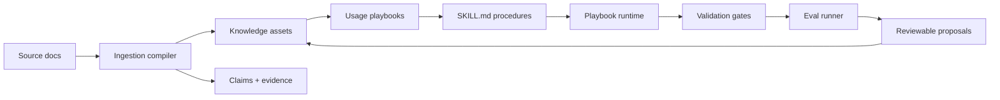

<p align="center">
  <a href="./README.md">English</a>
  ·
  <a href="https://2sao7sao.github.io/EvolveKB/">产品首页</a>
  ·
  <a href="./examples/evolution_loop.md">核心 Demo</a>
  ·
  <a href="./CONTRIBUTING.md">贡献指南</a>
</p>

<p align="center">
  
  
  
  
</p>

# 不要再把知识当成 chunks

**EvolveKB 把文档变成 Agent 可执行、可验证、可评审、可演进的知识运行时。**

RAG 能找相似片段，但 Agent 落地需要回答更关键的问题：

> 这份知识能不能变成一个 Agent 可以稳定执行、持续验证、不断修正的行为？

如果你的 Agent 依赖政策、SOP、runbook、研究笔记、内部方法论或工程规范，单纯
拼接 retrieved chunks 不够。模型需要知道知识是什么意思、什么时候该用、如何
执行、如何验证，以及实践失败后如何安全更新。


## 30 秒理解

```text
Docs -> Claims -> Knowledge Assets -> Usage Playbooks -> SKILL.md -> Gates -> Evals -> Proposals
```

EvolveKB 是一个 **execution-first knowledge runtime**：

| 不是... | 而是让知识变成... |
| --- | --- |
| 相似 chunk | 有类型、有来源、可检查的知识资产 |
| Prompt 堆料 | 绑定到明确 usage playbook |
| 一次性回答 | 通过 `SKILL.md` procedure 执行 |
| 静默漂移 | 由 gates 和 evals 保护 |
| 黑盒自动更新 | 生成可评审、可回滚的 proposal |

## 先跑 Demo

```bash
git clone https://github.com/2sao7sao/EvolveKB.git
cd EvolveKB
python -m pip install -e ".[dev]"
python examples/run_evolution_loop.py
```

这个 demo 会复制仓库到临时目录，摄取一份合成退款政策，生成可评审 proposal，
运行 gates 和 evals，并列出待评审知识更新，不会污染你的当前工作区。

## 为什么需要它

多数知识系统优化“检索”。Agent 系统需要的是“可操作知识”。

| 真实问题 | chunk retrieval 的弱点 | EvolveKB 的方向 |
| --- | --- | --- |
| 政策要驱动客服流程 | 模型看到文本，但不知道流程 | 绑定 usage assets 和 skills |
| 事故后 runbook 要更新 | 检索不管理安全变更 | 生成 proposal 并跑 gates |
| 设计规则有例外 | 相似度隐藏跨文档依赖 | 存 claims、concepts、evidence、usage rules |
| 知识更新可能破坏旧行为 | 向量库不做回归测试 | 接受变更前跑 evals |

## 你得到什么

| 层 | 作用 |
| --- | --- |
| `kb/knowledge` | 带摘要、概念、claims、evidence、source refs 的 typed knowledge assets。 |
| `kb/usage` | 描述某个 intent 应该如何使用知识。 |
| `skills/` | 把知识转成可复用行为的 `SKILL.md` procedures。 |
| `evolvekb/gates` | 校验 schema、引用、skill contract 和生产约束。 |
| `evolvekb/evals` | 回归测试 retrieval 与 routing 行为。 |
| `kb/proposals` | 知识变更先进入可审计 proposal，再被接受。 |

## 可信信号

本地最近验证：

| 信号 | 结果 | 命令 |
| --- | ---: | --- |
| 单测与集成测试 | `57 / 57 passed` | `python -m pytest -q` |
| 仓库 gates | `PASS` | `python -m evolvekb.cli validate --settings settings/evolve.yaml` |
| Retrieval eval | `1 / 1 passed` | `python -m evolvekb.cli eval run "evals/*.yaml"` |
| Routing eval | `1 / 1 passed` | `python -m evolvekb.cli eval run "evals/*.yaml"` |

这些是 regression seed，不是完整 benchmark。它们证明运行链路可执行；如果要声明
优于 RAG，还需要更大规模知识使用评测和 baseline 对照。

## 常用命令

```bash
# 验证仓库
python -m evolvekb.cli validate --settings settings/evolve.yaml

# 查询证据
python -m evolvekb.cli query "execution-first knowledge runtime" --require-evidence

# 运行知识驱动 playbook
python -m evolvekb.cli run \
  --intent compare_frameworks \
  --question "Compare GraphRAG vs Execution-first" \
  --settings settings/reference.yaml \
  --no-side-effects

# 从文档生成可演进 proposal
python -m evolvekb.cli ingest examples/refund_policy.md --proposal
```

## 适合什么

适合：

| 场景 | 原因 |
| --- | --- |
| 内部政策 / SOP | 知识需要触发受控行为。 |
| Agent skills / playbooks | Procedure 需要证据和回归测试。 |
| 研究笔记 / 设计系统 | 知识存在隐藏依赖和使用规则。 |
| Incident runbook | 实践结果应该反推知识更新。 |

不适合：

| 场景 | 更适合 |
| --- | --- |
| 一次性文档问答 | 普通 RAG 即可。 |
| 纯语义搜索 | 向量库或 hybrid retriever。 |
| 完全自动记忆写入 | 需要带隐私和用户控制的 memory 系统。 |

## 架构



## 仓库结构

```text
evolvekb/       # runtime、CLI、gates、ingestion、retrieval、evals
kb/             # knowledge assets、usage assets、index、evolution log
skills/         # 可执行 SKILL.md playbooks 和 procedures
settings/       # reference、digest、transform、evolve 预设
evals/          # retrieval 和 routing 回归样例
examples/       # demo 输入、输出和 replay
docs/           # 产品首页与文档
```

## Roadmap

| 方向 | 下一步 |
| --- | --- |
| Evaluation | 增加 RAG baseline 对照和 knowledge-use success metrics。 |
| Skills | 强化 `SKILL.md` contracts 和 failure-mode tests。 |
| Governance | 改进 proposal review、rollback metadata 和 change attribution。 |
| Agent integration | 增加 single-agent 与 multi-agent harness 示例。 |

## Security

不要提交私有文档、API key、token、客户 trace，或包含敏感信息的 proposal 输出。
见 [SECURITY.md](SECURITY.md)。

## License

MIT. See [LICENSE](LICENSE).
