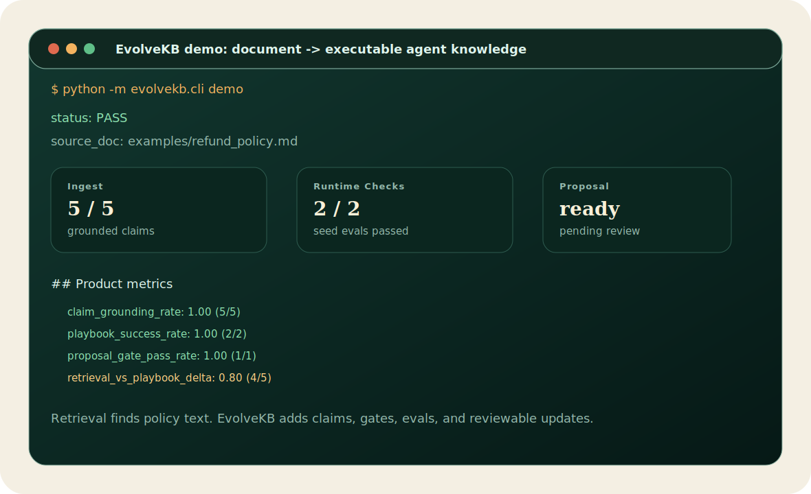
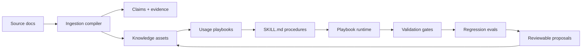

<p align="center">
  <a href="./README.md">English</a>
  ·
  <a href="https://2sao7sao.github.io/EvolveKB/">产品首页</a>
  ·
  <a href="./examples/evolution_loop.md">核心 Demo</a>
  ·
  <a href="./CONTRIBUTING.md">贡献指南</a>
</p>

<p align="center">
  
  
  
  
</p>

# EvolveKB

**Agent 知识运行时：把文档变成可执行、可验证、可演进的 Agent 知识资产。**

RAG 解决的是“找到相似文本”。EvolveKB 追问的是另一个更贴近 Agent 落地的问题：

> 这份文档能不能变成 Agent 可以执行、测试、评审，并在真实使用后安全更新的行为？

如果你的 Agent 依赖政策、SOP、runbook、研究笔记或工程规范，单纯把 chunk
塞进 prompt 不够。系统需要 claims、evidence、usage playbook、skill contract、
validation gate、regression eval，以及可评审的知识更新流程。



## 30 秒产品路径

```text
Document
  -> grounded claims
  -> typed knowledge asset
  -> usage playbook
  -> SKILL.md procedure
  -> validation gates
  -> regression evals
  -> reviewable proposal
```

| 如果你有... | EvolveKB 让 Agent 得到... |
| --- | --- |
| 政策文档 | 带证据的规则、例外和约束 |
| SOP / runbook | 可复用 playbook，而不是 prompt 堆料 |
| 内部方法论 | 什么时候用、如何用的 usage guidance |
| 知识漂移 | gates、evals、proposals 和 rollback 路径 |
| Agent harness | skills、evidence、governance 的运行时接口 |

## 5 分钟跑通 Demo

```bash
git clone https://github.com/2sao7sao/EvolveKB.git
cd EvolveKB
python -m pip install -e ".[dev]"
python -m evolvekb.cli demo
```

Demo 会在临时 workspace 中运行，不污染当前仓库。它会摄取一份合成退款政策，
抽取带证据的 claims，生成待评审 proposal，运行 gates 和 regression evals，
最后输出产品指标。

输出形态如下：

```text
# EvolveKB Flagship Demo

status: PASS

## 1. Ingest policy into knowledge assets
- claims: 5
- grounded_claims: 5
- proposal: kb/proposals/...

## 3. Product metrics
- claim_grounding_rate: 1.00 (5/5)
- playbook_success_rate: 1.00 (2/2)
- proposal_gate_pass_rate: 1.00 (1/1)
- retrieval_vs_playbook_delta: 0.80 (4/5)
```

如果你更喜欢直接看脚本，可以运行 `examples/run_evolution_loop.py`，它和 CLI demo
走同一条产品路径。

## 它为什么不只是 RAG

| 问题 | 纯检索知识库 | EvolveKB |
| --- | --- | --- |
| 能否找到相关文本 | 可以 | 可以 |
| 知识是否有 typed claims 和 evidence | 通常没有 | 有 |
| 系统是否知道知识该如何使用 | 通常没有 | usage playbooks |
| 工作流是否能作为可重复 skill 执行 | 不能 | `SKILL.md` procedures |
| 更新是否能被 gate 和 review | 很少 | proposals + validation |
| 行为回归是否能被测试 | 很少 | eval seeds + runtime checks |

> [!NOTE]
> 当前检索后端是 deterministic keyword retrieval。EvolveKB v0.3 不声明语义检索
> 能力优于 RAG，而是把重点放在“知识是否可操作”：可使用、可测试、可评审、可安全演进。

## 指标不是装饰

Demo 指标来自实际运行产物，不是手工写在 README 里的展示数字。

| 指标 | 衡量什么 | 当前来源 |
| --- | --- | --- |
| `claim_grounding_rate` | 抽取出的 claims 是否保留 source evidence | `evolvekb.ingestion.compiler` |
| `playbook_success_rate` | routing/retrieval seed eval 是否通过 | `evolvekb.evals.runner` |
| `proposal_gate_pass_rate` | proposal 生成后仓库 gates 是否仍然通过 | `evolvekb.demo` + `evolvekb.gates` |
| `retrieval_vs_playbook_delta` | 相比纯检索，执行式链路多覆盖了哪些能力 | `evolvekb.demo` |

直接运行 regression seed：

```bash
python -m evolvekb.cli eval run "evals/*.yaml"
```

## 开发者接口

```bash
# 验证 knowledge、usage assets、skills 和 gate constraints
python -m evolvekb.cli validate --settings settings/evolve.yaml

# 从 knowledge assets 和 compiled claims 查询证据
python -m evolvekb.cli query "execution-first knowledge runtime" --require-evidence

# 运行知识驱动 playbook
python -m evolvekb.cli run \
  --intent compare_frameworks \
  --question "Compare GraphRAG vs Execution-first" \
  --settings settings/reference.yaml \
  --no-side-effects

# 从文档生成可评审 proposal
python -m evolvekb.cli ingest examples/refund_policy.md --proposal
```

最小 harness 接入示例：

```python
from pathlib import Path

from evolvekb.skills.runtime import PlaybookRuntime

runtime = PlaybookRuntime(Path("."))
result = runtime.run(
    intent="answer_with_evidence",
    question="What does the KB say about execution-first knowledge?",
    settings_arg="settings/reference.yaml",
    write_side_effects=False,
)
print(result.rendered)
```

## 架构



## 稳定能力与原型边界

| 层 | 当前状态 |
| --- | --- |
| Asset schemas | 足够支撑本地实验和示例 |
| CLI demo、validate、query、run、ingest、eval | 当前支持的产品路径 |
| Proposal creation / rollback | 支持本地文件 |
| Keyword retrieval | 原型 baseline，不是最终检索策略 |
| Procedure implementations | deterministic MVP 示例，不是完整 skill marketplace |
| Benchmark claims | seed-level proof，不是大规模 RAG 替代 benchmark |

## 适合 / 不适合

适合：

| 场景 | 原因 |
| --- | --- |
| Agent 政策和 SOP | 知识需要触发受控行为 |
| 客服、合规、运维 playbook | 回答需要证据、路由和审批 |
| 研究到实践的方法论 | 隐藏用法比相似 chunk 更重要 |
| 事故后持续演进的 runbook | 实践结果应该通过 review 更新知识 |

不适合：

| 场景 | 更合适的方案 |
| --- | --- |
| 一次性文档问答 | 普通 RAG 更快 |
| 纯语义搜索 | vector / hybrid retrieval |
| 用户记忆和个性化 | 需要带隐私控制的 memory system |
| 未评审的自动写入 | 先增加 human review 和 approval gates |

## 仓库结构

```text
evolvekb/       runtime、CLI、demo metrics、gates、ingestion、retrieval、evals
kb/             knowledge assets、usage assets、index、evolution log
skills/         可执行 SKILL.md playbooks 和 procedures
settings/       reference、digest、transform、evolve 预设
evals/          retrieval、routing、capability coverage seeds
examples/       可运行 demo 输入和产品 walkthrough
docs/           产品首页和补充说明
```

## Roadmap

| 方向 | 下一步 |
| --- | --- |
| Retrieval | 在同一 evidence contract 后面增加 semantic / hybrid retriever |
| Evaluation | 增加 RAG baseline tasks 和更大规模 knowledge-use benchmark |
| Skills | 强化 skill contracts、failure modes 和 harness examples |
| Governance | 完善 proposal review metadata、approval 和 rollback report |
| Agent integration | 增加 single-agent / multi-agent harness recipes |

## Security

不要提交私有文档、API key、token、客户 trace，或包含敏感信息的 proposal 输出。
见 [SECURITY.md](SECURITY.md)。

## License

MIT. See [LICENSE](LICENSE).
